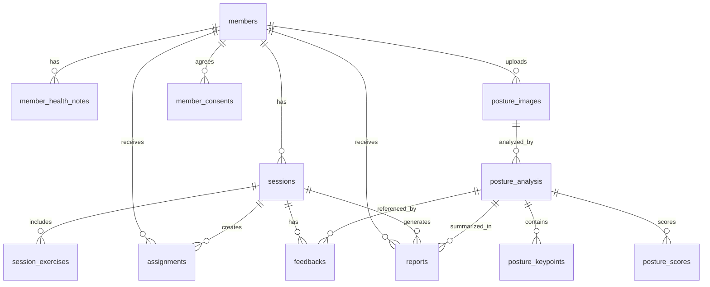

# FitNote Trainer ERD 테이블 후보

## 1. ERD 설계 방향

FitNote Trainer의 ERD는 4일 미니 프로젝트 기준으로 MVP 핵심 흐름을 먼저 구현할 수 있게 설계한다.

핵심 흐름:

1. 트레이너가 회원을 등록한다.
2. 회원의 목표, 통증, 주의사항을 확인한다.
3. 수업 후 세션 기록을 작성한다.
4. 회원 자세 사진을 업로드한다.
5. 자세 분석 결과와 점수를 저장한다.
6. 트레이너가 피드백과 과제를 등록한다.
7. 회원에게 간단 리포트를 생성한다.

설계 원칙:

- SQLite 기준으로 단순하게 설계한다.
- Day 3 산출물 기준에 맞게 PK, FK, CHECK 제약을 넣을 수 있는 구조로 만든다.
- 실제 개인정보나 민감 건강정보는 사용하지 않고 샘플 데이터만 저장한다.
- 자세 분석은 스쿼트 1개 동작 데모를 기준으로 한다.
- 실제 YOLO 분석이 어렵다면 분석 결과는 더미 데이터 또는 규칙 기반 결과로 저장한다.

## 2. MVP 핵심 테이블

### 2.1 members

회원 기본 정보를 저장하는 테이블이다.

관련 기능:

- FR-001. 회원 프로필 등록
- FR-002. 회원 상세 조회
- FR-003. 회원별 세션 기록 작성
- FR-005. 회원 사진 업로드
- FR-009. 과제 등록

주요 컬럼 후보:

| 컬럼명 | 타입 | 설명 |
| --- | --- | --- |
| id | INTEGER PK | 회원 ID |
| name | TEXT NOT NULL | 회원 이름 |
| phone | TEXT | 연락처 |
| age | INTEGER | 나이 |
| gender | TEXT | 성별 |
| fitness_goal | TEXT | 운동 목표 |
| exercise_experience | TEXT | 운동 경험 |
| created_at | TEXT | 등록일 |
| updated_at | TEXT | 수정일 |

관계:

- members 1:N member_health_notes
- members 1:N sessions
- members 1:N posture_images
- members 1:N assignments
- members 1:N reports

## 2.2 member_health_notes

회원의 통증, 부상, 주의사항을 저장하는 테이블이다.

관련 기능:

- FR-001. 회원 프로필 등록
- FR-002. 회원 상세 조회
- FR-013. 좌우 비대칭/가동성 특이사항 입력

주요 컬럼 후보:

| 컬럼명 | 타입 | 설명 |
| --- | --- | --- |
| id | INTEGER PK | 건강 주의사항 ID |
| member_id | INTEGER FK | 회원 ID |
| pain_area | TEXT | 통증 부위 |
| injury_history | TEXT | 부상 이력 |
| precautions | TEXT | 수업 주의사항 |
| asymmetry_note | TEXT | 좌우 비대칭 또는 가동성 특이사항 |
| created_at | TEXT | 등록일 |

관계:

- member_health_notes N:1 members

비고:

- 의료 진단 정보가 아니라 운동 지도 참고 정보로 표현한다.
- 발표용 데이터는 모두 가상 데이터로 사용한다.

## 2.3 sessions

PT 수업 단위 기록을 저장하는 테이블이다.

관련 기능:

- FR-003. 회원별 세션 기록 작성
- FR-004. 세션 기록 목록 및 이전 기록 확인
- FR-008. 트레이너 피드백 작성
- FR-010. 간단 리포트 생성

주요 컬럼 후보:

| 컬럼명 | 타입 | 설명 |
| --- | --- | --- |
| id | INTEGER PK | 세션 ID |
| member_id | INTEGER FK | 회원 ID |
| session_date | TEXT NOT NULL | 수업일 |
| focus_area | TEXT | 운동 부위 |
| memo | TEXT | 오늘의 특이사항 |
| next_memo | TEXT | 다음 수업 메모 |
| raw_voice_text | TEXT | 음성 전사로 가정한 입력 텍스트 |
| summary | TEXT | 세션 요약 |
| created_at | TEXT | 작성일 |

관계:

- sessions N:1 members
- sessions 1:N session_exercises
- sessions 1:N feedbacks
- sessions 1:N assignments
- sessions 1:N reports

## 2.4 session_exercises

세션에서 수행한 운동 종목, 세트, 횟수, 중량을 저장하는 테이블이다.

관련 기능:

- FR-003. 회원별 세션 기록 작성
- FR-004. 세션 기록 목록 및 이전 기록 확인

주요 컬럼 후보:

| 컬럼명 | 타입 | 설명 |
| --- | --- | --- |
| id | INTEGER PK | 세션 운동 ID |
| session_id | INTEGER FK | 세션 ID |
| exercise_name | TEXT NOT NULL | 운동명 |
| sets | INTEGER | 세트 수 |
| reps | INTEGER | 반복 횟수 |
| weight | REAL | 중량 |
| note | TEXT | 운동별 메모 |

관계:

- session_exercises N:1 sessions

비고:

- MVP에서는 세션 본문에 운동 내용을 텍스트로만 저장해도 되지만, ERD/SQL 산출물 기준으로는 별도 테이블 분리가 더 좋다.

## 2.5 posture_images

회원의 자세 사진 업로드 정보를 저장하는 테이블이다.

관련 기능:

- FR-005. 회원 사진 업로드
- FR-006. YOLO 기반 자세 분석
- FR-028. 자세 분석 히스토리 상세 보기

주요 컬럼 후보:

| 컬럼명 | 타입 | 설명 |
| --- | --- | --- |
| id | INTEGER PK | 자세 이미지 ID |
| member_id | INTEGER FK | 회원 ID |
| session_id | INTEGER FK NULL | 연결된 세션 ID |
| movement_name | TEXT | 운동 동작명 |
| image_path | TEXT NOT NULL | 이미지 파일 경로 |
| upload_status | TEXT | 업로드/분석 상태 |
| uploaded_at | TEXT | 업로드일 |

관계:

- posture_images N:1 members
- posture_images N:1 sessions
- posture_images 1:1 또는 1:N posture_analysis

CHECK 후보:

- upload_status IN ('uploaded', 'analyzing', 'analyzed', 'failed')

## 2.6 posture_analysis

자세 분석 결과의 큰 단위를 저장하는 테이블이다.

관련 기능:

- FR-006. YOLO 기반 자세 분석
- FR-007. 자세 점수 및 시각화
- FR-008. 트레이너 피드백 작성
- FR-020. 자세 점수 변화 기록
- FR-028. 자세 분석 히스토리 상세 보기

주요 컬럼 후보:

| 컬럼명 | 타입 | 설명 |
| --- | --- | --- |
| id | INTEGER PK | 자세 분석 ID |
| posture_image_id | INTEGER FK | 자세 이미지 ID |
| model_name | TEXT | 분석 모델명 또는 더미 분석 방식 |
| movement_name | TEXT | 분석 대상 동작 |
| analysis_status | TEXT | 분석 상태 |
| main_issue | TEXT | 주요 문제 |
| sub_issue | TEXT | 보조 문제 |
| result_note | TEXT | 분석 설명 |
| analyzed_at | TEXT | 분석일 |

관계:

- posture_analysis N:1 posture_images
- posture_analysis 1:N posture_keypoints
- posture_analysis 1:1 posture_scores
- posture_analysis 1:N feedbacks

CHECK 후보:

- analysis_status IN ('pending', 'success', 'failed')

## 2.7 posture_keypoints

자세 분석에서 탐지한 주요 관절 포인트를 저장하는 테이블이다.

관련 기능:

- FR-006. YOLO 기반 자세 분석
- FR-014. 관절 정보 기반 자세 분석 보정

주요 컬럼 후보:

| 컬럼명 | 타입 | 설명 |
| --- | --- | --- |
| id | INTEGER PK | 키포인트 ID |
| analysis_id | INTEGER FK | 자세 분석 ID |
| point_name | TEXT NOT NULL | 관절 포인트명 |
| x | REAL | 이미지 내 x좌표 |
| y | REAL | 이미지 내 y좌표 |
| confidence | REAL | 탐지 신뢰도 |

관계:

- posture_keypoints N:1 posture_analysis

비고:

- 4일 데모에서는 실제 좌표 대신 샘플 키포인트를 저장해도 된다.

## 2.8 posture_scores

자세 점수와 세부 평가 항목을 저장하는 테이블이다.

관련 기능:

- FR-007. 자세 점수 및 시각화
- FR-020. 자세 점수 변화 기록
- FR-022. 회원별 변화 리포트

주요 컬럼 후보:

| 컬럼명 | 타입 | 설명 |
| --- | --- | --- |
| id | INTEGER PK | 자세 점수 ID |
| analysis_id | INTEGER FK | 자세 분석 ID |
| total_score | INTEGER | 총점 |
| knee_alignment_score | INTEGER | 무릎 정렬 점수 |
| upper_body_score | INTEGER | 상체 기울기 점수 |
| pelvis_balance_score | INTEGER | 골반 균형 점수 |
| lower_body_stability_score | INTEGER | 발 위치/하체 안정성 점수 |
| improvement_points | TEXT | 개선 필요 항목 |
| created_at | TEXT | 생성일 |

관계:

- posture_scores N:1 posture_analysis

CHECK 후보:

- total_score BETWEEN 0 AND 100

## 2.9 feedbacks

트레이너가 작성한 최종 피드백을 저장하는 테이블이다.

관련 기능:

- FR-008. 트레이너 피드백 작성
- FR-010. 간단 리포트 생성

주요 컬럼 후보:

| 컬럼명 | 타입 | 설명 |
| --- | --- | --- |
| id | INTEGER PK | 피드백 ID |
| member_id | INTEGER FK | 회원 ID |
| session_id | INTEGER FK NULL | 세션 ID |
| analysis_id | INTEGER FK NULL | 자세 분석 ID |
| trainer_comment | TEXT NOT NULL | 트레이너 코멘트 |
| caution_note | TEXT | 주의사항 |
| next_check_point | TEXT | 다음 수업 확인사항 |
| created_at | TEXT | 작성일 |

관계:

- feedbacks N:1 members
- feedbacks N:1 sessions
- feedbacks N:1 posture_analysis

비고:

- AI 분석 결과는 참고 자료이고, 최종 피드백은 트레이너가 작성한다는 원칙을 반영한다.

## 2.10 assignments

회원에게 부여한 과제를 저장하는 테이블이다.

관련 기능:

- FR-009. 과제 등록
- FR-021. 과제 수행 체크
- FR-010. 간단 리포트 생성

주요 컬럼 후보:

| 컬럼명 | 타입 | 설명 |
| --- | --- | --- |
| id | INTEGER PK | 과제 ID |
| member_id | INTEGER FK | 회원 ID |
| session_id | INTEGER FK NULL | 세션 ID |
| title | TEXT NOT NULL | 과제명 |
| description | TEXT | 과제 내용 |
| target_amount | TEXT | 목표량 |
| due_date | TEXT | 마감일 |
| status | TEXT | 과제 상태 |
| created_at | TEXT | 등록일 |
| completed_at | TEXT | 완료일 |

관계:

- assignments N:1 members
- assignments N:1 sessions

CHECK 후보:

- status IN ('unchecked', 'in_progress', 'completed')

## 2.11 reports

회원에게 보여줄 수 있는 간단 리포트를 저장하는 테이블이다.

관련 기능:

- FR-010. 간단 리포트 생성
- FR-022. 회원별 변화 리포트
- FR-027. PDF 리포트 출력

주요 컬럼 후보:

| 컬럼명 | 타입 | 설명 |
| --- | --- | --- |
| id | INTEGER PK | 리포트 ID |
| member_id | INTEGER FK | 회원 ID |
| session_id | INTEGER FK NULL | 세션 ID |
| analysis_id | INTEGER FK NULL | 자세 분석 ID |
| report_title | TEXT | 리포트 제목 |
| workout_summary | TEXT | 오늘의 운동 요약 |
| posture_summary | TEXT | 자세 분석 요약 |
| good_points | TEXT | 잘한 점 |
| caution_points | TEXT | 주의할 점 |
| next_assignment | TEXT | 다음 과제 |
| created_at | TEXT | 생성일 |

관계:

- reports N:1 members
- reports N:1 sessions
- reports N:1 posture_analysis

## 2.12 member_consents

신체·관절 정보 수집 안내와 동의 여부를 저장하는 테이블이다.

관련 기능:

- FR-016. 신체·관절 정보 수집 안내

주요 컬럼 후보:

| 컬럼명 | 타입 | 설명 |
| --- | --- | --- |
| id | INTEGER PK | 동의 ID |
| member_id | INTEGER FK | 회원 ID |
| consent_type | TEXT | 동의 유형 |
| consent_text | TEXT | 안내 문구 |
| is_agreed | INTEGER | 동의 여부 |
| agreed_at | TEXT | 동의일 |

관계:

- member_consents N:1 members

CHECK 후보:

- is_agreed IN (0, 1)

비고:

- 미니 프로젝트에서는 실제 법적 동의 절차가 아니라 안내 문구 표시 수준으로 처리해도 된다.

## 3. Should Have 확장 테이블

### 3.1 member_body_profiles

회원의 키, 체중, 체형 특성 등 자세 분석 참고용 신체 기준 정보를 저장한다.

관련 기능:

- FR-011. 신체 기준 정보 입력
- FR-015. 분석 기준 정보 표시

주요 컬럼 후보:

| 컬럼명 | 타입 | 설명 |
| --- | --- | --- |
| id | INTEGER PK | 신체 기준 정보 ID |
| member_id | INTEGER FK | 회원 ID |
| height_cm | REAL | 키 |
| weight_kg | REAL | 체중 |
| body_type_note | TEXT | 체형 특성 메모 |
| created_at | TEXT | 등록일 |

## 3.2 member_joint_profiles

회원의 어깨, 골반, 무릎, 발목 등 주요 관절 기준 정보를 저장한다.

관련 기능:

- FR-012. 관절 기준 정보 입력
- FR-013. 좌우 비대칭/가동성 특이사항 입력
- FR-014. 관절 정보 기반 자세 분석 보정

주요 컬럼 후보:

| 컬럼명 | 타입 | 설명 |
| --- | --- | --- |
| id | INTEGER PK | 관절 기준 정보 ID |
| member_id | INTEGER FK | 회원 ID |
| shoulder_note | TEXT | 어깨 관련 특이사항 |
| pelvis_note | TEXT | 골반 관련 특이사항 |
| knee_note | TEXT | 무릎 관련 특이사항 |
| ankle_note | TEXT | 발목 관련 특이사항 |
| mobility_note | TEXT | 가동성 메모 |
| created_at | TEXT | 등록일 |

## 3.3 inbody_records

인바디 검사 업로드 기록을 저장한다.

관련 기능:

- FR-017. 인바디 검사 결과 업로드
- FR-018. 인바디 변화 비교
- FR-019. 신체 변화 시각화

주요 컬럼 후보:

| 컬럼명 | 타입 | 설명 |
| --- | --- | --- |
| id | INTEGER PK | 인바디 기록 ID |
| member_id | INTEGER FK | 회원 ID |
| measured_at | TEXT | 측정일 |
| file_path | TEXT | 업로드 파일 경로 |
| memo | TEXT | 메모 |

## 3.4 inbody_metrics

인바디 주요 수치를 저장한다.

관련 기능:

- FR-018. 인바디 변화 비교
- FR-019. 신체 변화 시각화
- FR-022. 회원별 변화 리포트

주요 컬럼 후보:

| 컬럼명 | 타입 | 설명 |
| --- | --- | --- |
| id | INTEGER PK | 인바디 수치 ID |
| inbody_record_id | INTEGER FK | 인바디 기록 ID |
| weight_kg | REAL | 체중 |
| skeletal_muscle_kg | REAL | 골격근량 |
| body_fat_percent | REAL | 체지방률 |
| bmi | REAL | BMI |

## 3.5 assignment_completions

과제 수행 체크 이력을 별도로 저장한다.

관련 기능:

- FR-021. 과제 수행 체크

주요 컬럼 후보:

| 컬럼명 | 타입 | 설명 |
| --- | --- | --- |
| id | INTEGER PK | 과제 수행 기록 ID |
| assignment_id | INTEGER FK | 과제 ID |
| checked_at | TEXT | 확인일 |
| status | TEXT | 수행 상태 |
| note | TEXT | 확인 메모 |

비고:

- MVP에서는 assignments 테이블의 status만으로 처리할 수 있다.
- 수행 이력을 누적하려면 별도 테이블로 분리한다.

## 3.6 exercise_templates

트레이너가 자주 쓰는 운동 루틴 템플릿을 저장한다.

관련 기능:

- FR-023. 운동 템플릿

주요 컬럼 후보:

| 컬럼명 | 타입 | 설명 |
| --- | --- | --- |
| id | INTEGER PK | 템플릿 ID |
| template_name | TEXT NOT NULL | 템플릿명 |
| target_area | TEXT | 운동 부위 |
| description | TEXT | 설명 |
| created_at | TEXT | 생성일 |

## 3.7 template_items

운동 템플릿에 포함된 운동 항목을 저장한다.

관련 기능:

- FR-023. 운동 템플릿

주요 컬럼 후보:

| 컬럼명 | 타입 | 설명 |
| --- | --- | --- |
| id | INTEGER PK | 템플릿 항목 ID |
| template_id | INTEGER FK | 템플릿 ID |
| exercise_name | TEXT NOT NULL | 운동명 |
| default_sets | INTEGER | 기본 세트 |
| default_reps | INTEGER | 기본 횟수 |
| default_weight | REAL | 기본 중량 |

## 4. Could Have 확장 테이블

### 4.1 pt_schedules

회원별 다음 PT 일정을 저장한다.

관련 기능:

- FR-024. 일정 관리
- FR-026. 과제/수업 전 알림

주요 컬럼 후보:

| 컬럼명 | 타입 | 설명 |
| --- | --- | --- |
| id | INTEGER PK | 일정 ID |
| member_id | INTEGER FK | 회원 ID |
| scheduled_at | TEXT | 수업 예정일시 |
| status | TEXT | 일정 상태 |
| memo | TEXT | 일정 메모 |

CHECK 후보:

- status IN ('scheduled', 'completed', 'cancelled')

## 4.2 notifications

알림 발송 대상과 상태를 저장한다.

관련 기능:

- FR-026. 과제/수업 전 알림

주요 컬럼 후보:

| 컬럼명 | 타입 | 설명 |
| --- | --- | --- |
| id | INTEGER PK | 알림 ID |
| member_id | INTEGER FK | 회원 ID |
| assignment_id | INTEGER FK NULL | 과제 ID |
| schedule_id | INTEGER FK NULL | 일정 ID |
| notification_type | TEXT | 알림 유형 |
| message | TEXT | 알림 내용 |
| status | TEXT | 발송 상태 |
| created_at | TEXT | 생성일 |

비고:

- 이번 프로젝트에서는 구현 제외 또는 개념 설계만 권장한다.

## 4.3 report_exports

리포트 PDF 출력 기록을 저장한다.

관련 기능:

- FR-027. PDF 리포트 출력

주요 컬럼 후보:

| 컬럼명 | 타입 | 설명 |
| --- | --- | --- |
| id | INTEGER PK | 출력 기록 ID |
| report_id | INTEGER FK | 리포트 ID |
| export_type | TEXT | 출력 형식 |
| file_path | TEXT | 출력 파일 경로 |
| exported_at | TEXT | 출력일 |

비고:

- MVP 핵심 흐름은 아니므로 발표용으로는 제외해도 된다.

## 5. MVP 권장 ERD 최소안

4일 프로젝트에서 실제 구현까지 고려하면 아래 8개 테이블을 우선 권장한다.

1. members
2. member_health_notes
3. sessions
4. session_exercises
5. posture_images
6. posture_analysis
7. posture_scores
8. feedbacks
9. assignments
10. reports
11. member_consents

단, 시간이 부족하면 아래 6개 테이블로 축소할 수 있다.

1. members
2. sessions
3. posture_images
4. posture_analysis
5. assignments
6. reports

축소 시 처리 방식:

- 통증/주의사항은 members 내부 컬럼으로 저장
- 운동 상세는 sessions 내부 텍스트로 저장
- 자세 점수는 posture_analysis 내부 컬럼으로 저장
- 트레이너 피드백은 reports 또는 sessions 내부 컬럼으로 저장

## 6. ERD 관계 요약

## 7. Day 3 산출물용 테이블 우선순위

가이드 PDF의 Day 3 기준은 `ERD 다이어그램`, `CREATE TABLE 전체 SQL 5~6개 테이블`, `샘플 데이터 적재`, `분석 쿼리 5개 이상`이다.

따라서 발표용 최소 SQL은 아래 6개 테이블부터 작성하는 것을 추천한다.

| 우선순위 | 테이블 | 이유 |
| --- | --- | --- |
| 1 | members | 모든 기능의 기준 엔티티 |
| 2 | sessions | 수업 기록 핵심 |
| 3 | posture_images | 자세 분석 입력 데이터 |
| 4 | posture_analysis | 자세 분석 결과 저장 |
| 5 | assignments | 과제 등록 및 관리 |
| 6 | reports | 회원에게 보여줄 최종 산출물 |

추가 여유가 있으면 아래 테이블을 붙인다.

| 우선순위 | 테이블 | 이유 |
| --- | --- | --- |
| 7 | member_health_notes | 통증/주의사항 정규화 |
| 8 | session_exercises | 운동 상세 정규화 |
| 9 | posture_scores | 점수 변화 분석 |
| 10 | feedbacks | 트레이너 판단 기록 |
| 11 | member_consents | 개인정보/민감정보 안내 반영 |
