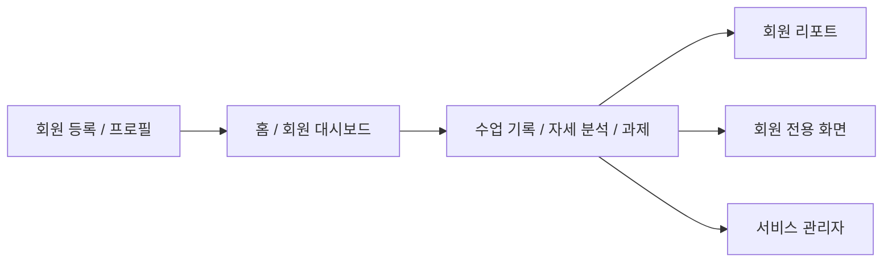
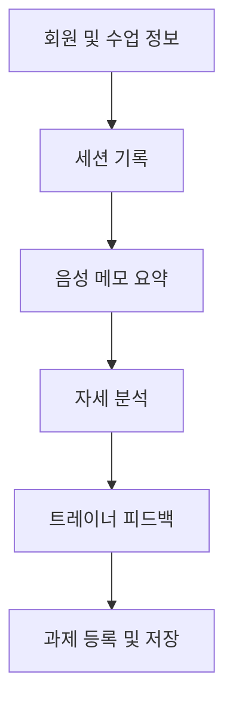

# FitNote Trainer Gradio Screen Flow

## 1. 화면 구성 방향

FitNote Trainer의 Gradio 화면은 6개 탭으로 구성한다.

가이드 PDF의 `Gradio Tabs` 예시처럼 탭 수를 과하게 늘리지 않고, 발표 데모 흐름이 끊기지 않도록 구성한다.

핵심 방향:

- 수업 전 확인은 `홈 / 회원 대시보드`에서 처리하고, 오늘 운동 체크 후 세션 시작까지 이어진다.
- 신규 회원 등록은 `회원 등록 / 프로필`에서 처리한다.
- 수업 후 핵심 작업인 세션 기록, 자세 분석, 피드백, 과제 등록은 하나의 탭으로 묶는다.
- 최종 산출물은 `회원 리포트`에서 확인한다.
- 회원이 직접 확인하는 과제, 일정, 변화 기록은 `회원 전용 화면`에서 확인한다.
- 서비스 운영자는 `서비스 관리자`에서 트레이너/회원 사용량과 서비스 활성도를 확인한다.

최종 탭 구성:

1. 홈 / 회원 대시보드
2. 회원 등록 / 프로필
3. 수업 기록 / 자세 분석 / 과제
4. 회원 리포트
5. 회원 전용 화면
6. 서비스 관리자

## 2. 전체 데모 흐름

발표 데모에서는 아래 순서로 시연한다.

1. `회원 등록 / 프로필` 탭에서 박수진 회원을 등록한다.
2. `홈 / 회원 대시보드` 탭에서 등록된 회원의 목표, 통증, 최근 기록을 확인한다.
3. `수업 기록 / 자세 분석 / 과제` 탭에서 수업 후 기록을 작성한다.
4. 같은 탭에서 텍스트화된 음성 메모를 요약한다.
5. 같은 탭에서 자세 사진을 업로드하고 자세 분석 결과를 확인한다.
6. 같은 탭에서 트레이너 피드백과 과제를 저장한다.
7. `회원 리포트` 탭에서 회원에게 보여줄 최종 리포트를 생성한다.
8. `서비스 관리자` 탭에서 트레이너별 사용량, 회원별 사용량, 과제 완료율, 자세 분석 품질을 확인한다.



## 3. Tab 1. 홈 / 회원 대시보드

### 목적

트레이너가 수업 전에 회원 상태를 빠르게 확인하는 화면이다.

이 탭은 김도현 트레이너의 핵심 페인포인트인 `기억 의존`, `정보 파편화`, `수업 전 불안감`을 해결하는 역할을 한다.

### 주요 사용자

- 트레이너

### 화면 구성

#### 1. 회원 검색 및 선택 영역

- 회원 이름 검색
- 회원 선택 드롭다운
- 선택 회원 불러오기 버튼

#### 2. 회원 요약 카드

- 회원 이름
- 운동 목표
- 운동 경험
- 통증 부위
- 부상 이력
- 주의사항

#### 3. 최근 수업 요약

- 최근 수업일
- 최근 운동 부위
- 최근 수행 운동
- 최근 특이사항
- 다음 수업 메모

#### 4. 최근 자세 분석 요약

- 최근 자세 점수
- 주요 문제
- 개선 포인트
- 최근 분석일

#### 5. 진행 중 과제 요약

- 과제명
- 목표량
- 마감일
- 상태

#### 6. 미니 달력 및 오늘 수업 확인

- 월간 미니 달력
- 오늘 수업 목록
- 간단 메모

#### 7. 오늘 세션 운동 체크 및 시작

- 오늘 진행할 운동종목 체크박스
- 세션 시작 버튼
- 버튼 클릭 후 `수업 기록 / 자세 분석 / 과제` 탭으로 이동

### 입력

| 입력 항목 | 컴포넌트 후보 |
| --- | --- |
| 회원 검색어 | `gr.Textbox` |
| 회원 선택 | `gr.Dropdown` |
| 간단 메모 | `gr.Textbox` |
| 오늘 운동 체크 | `gr.CheckboxGroup` |
| 조회 버튼 | `gr.Button` |
| 세션 시작 | `gr.Button` |

### 출력

| 출력 항목 | 컴포넌트 후보 |
| --- | --- |
| 회원 요약 | `gr.Markdown` |
| 최근 수업 기록 | `gr.Dataframe` 또는 `gr.Markdown` |
| 최근 자세 분석 | `gr.Markdown` |
| 진행 중 과제 | `gr.Dataframe` |
| 미니 달력 | `gr.HTML` |
| 오늘 수업 | `gr.Dataframe` |

### 연결 테이블

- `members`
- `member_health_notes`
- `sessions`
- `session_exercises`
- `posture_analysis`
- `posture_scores`
- `assignments`
- `reports`

### 표시 예시

```text
박수진 회원 요약

- 목표: 체중 감량, 자세 교정
- 통증/주의사항: 허리 통증, 무릎 정렬 주의
- 최근 수업: 하체 운동 / 스쿼트 3세트 12회
- 최근 자세 점수: 72점
- 진행 중 과제: 벽 스쿼트 20회, 고관절 스트레칭 10분
```

## 4. Tab 2. 회원 등록 / 프로필

### 목적

신규 회원의 기본 정보, 운동 목표, 운동 경험, 통증 및 주의사항을 등록하는 화면이다.

회원 프로필은 이후 세션 기록, 자세 분석, 과제, 리포트의 기준 데이터가 된다.

### 주요 사용자

- 트레이너

### 화면 구성

#### 1. 기본 정보 입력

- 이름
- 연락처
- 나이
- 성별

#### 2. 운동 정보 입력

- 운동 목표
- 운동 경험
- 운동 빈도

#### 3. 건강 주의사항 입력

- 통증 부위
- 부상 이력
- 수업 주의사항
- 가동성 체크 자유 텍스트
- 비대칭 유무: 어깨, 골반, 기타 입력

#### 4. 선택 이미지 등록

- 인바디 프린트 이미지 업로드
- 정자세 사진 업로드
- 둘 다 선택 입력이며, 없어도 회원 등록 가능

#### 5. 신체·관절 정보 수집 안내

- 자세 분석 참고용으로만 사용한다는 안내 문구
- 의료 진단이 아니라 운동 자세 참고 정보라는 안내 문구
- 동의 체크박스

#### 6. 저장 및 초기화

- 회원 등록 버튼
- 입력 초기화 버튼
- 등록 결과 메시지

### 입력

| 입력 항목 | 컴포넌트 후보 |
| --- | --- |
| 이름 | `gr.Textbox` |
| 연락처 | `gr.Textbox` |
| 나이 | `gr.Number` |
| 성별 | `gr.Radio` |
| 운동 목표 | `gr.Textbox` |
| 운동 경험 | `gr.Textbox` |
| 인바디 이미지 | `gr.Image` |
| 정자세 사진 | `gr.Image` |
| 가동성 체크 | `gr.Textbox` |
| 어깨 비대칭 | `gr.Checkbox` |
| 골반 비대칭 | `gr.Checkbox` |
| 기타 비대칭 | `gr.Textbox` |
| 통증 부위 | `gr.Textbox` |
| 부상 이력 | `gr.Textbox` |
| 주의사항 | `gr.Textbox` |
| 정보 수집 안내 동의 | `gr.Checkbox` |

### 출력

| 출력 항목 | 컴포넌트 후보 |
| --- | --- |
| 등록 결과 메시지 | `gr.Markdown` |
| 등록된 회원 미리보기 | `gr.JSON` 또는 `gr.Markdown` |

### 연결 테이블

- `members`
- `member_health_notes`
- `member_body_profiles`
- `posture_images`
- `member_consents`

### 검증 규칙

- 이름은 필수 입력이다.
- 운동 목표는 필수 입력이다.
- 통증/주의사항이 없으면 `없음`으로 저장할 수 있다.
- 신체·관절 정보 안내 동의가 없으면 민감 정보 저장을 제한하거나 안내 메시지를 표시한다.

## 5. Tab 3. 수업 기록 / 자세 분석 / 과제

### 목적

수업 후 트레이너가 해야 하는 핵심 작업을 한 화면에서 처리한다.

이 탭은 기존의 세션 기록, 음성 메모 요약, 자세 분석, 피드백 작성, 과제 등록을 하나로 묶은 핵심 데모 화면이다.

### 주요 사용자

- 트레이너

### 화면 구성 개요

이 탭은 위에서 아래로 자연스럽게 흐르는 6개 블록으로 구성한다.

1. 회원 및 수업 정보
2. 세션 기록
3. 음성 메모 요약 데모
4. 자세 분석
5. 트레이너 피드백
6. 과제 등록 및 저장



### 5.1 회원 및 수업 정보

#### 입력

| 입력 항목 | 컴포넌트 후보 |
| --- | --- |
| 회원 선택 | `gr.Dropdown` |
| 수업일 | `gr.Textbox` 또는 `gr.DateTime` 대체 입력 |
| 운동 부위 | `gr.Dropdown` |
| 수업 메모 | `gr.Textbox` |

#### 연결 테이블

- `members`
- `sessions`

### 5.2 세션 기록

#### 입력

| 입력 항목 | 컴포넌트 후보 |
| --- | --- |
| 운동명 | `gr.Textbox` |
| 세트 수 | `gr.Number` |
| 반복 횟수 | `gr.Number` |
| 중량 | `gr.Number` |
| 특이사항 | `gr.Textbox` |
| 다음 수업 메모 | `gr.Textbox` |

#### 출력

| 출력 항목 | 컴포넌트 후보 |
| --- | --- |
| 세션 기록 미리보기 | `gr.Markdown` |

#### 연결 테이블

- `sessions`
- `session_exercises`

### 5.3 음성 메모 요약 데모

#### 목적

실제 음성 녹음과 STT API는 구현하지 않고, 텍스트화된 음성 예시를 입력해 요약 폼 자동 채움처럼 시연한다.

#### 입력

| 입력 항목 | 컴포넌트 후보 |
| --- | --- |
| 텍스트화된 음성 메모 | `gr.Textbox(lines=5)` |
| 요약 실행 버튼 | `gr.Button` |

#### 출력

| 출력 항목 | 컴포넌트 후보 |
| --- | --- |
| 추출된 운동 내용 | `gr.Textbox` |
| 추출된 주의사항 | `gr.Textbox` |
| 추출된 과제 후보 | `gr.Textbox` |
| 요약 결과 | `gr.Markdown` |

#### 예시 입력

```text
오늘 박수진 회원은 하체 운동을 진행했다. 스쿼트 3세트 12회, 런지 2세트 10회를 수행했다. 무릎이 안쪽으로 모이는 경향이 있어 다음 수업 때 자세 확인이 필요하다. 과제로는 벽 스쿼트 20회와 고관절 스트레칭 10분을 안내했다.
```

#### 예시 출력

```text
운동 내용: 스쿼트 3세트 12회, 런지 2세트 10회
주의사항: 무릎이 안쪽으로 모이는 경향
과제 후보: 벽 스쿼트 20회, 고관절 스트레칭 10분
```

#### 연결 테이블

- `sessions`
- `assignments`

### 5.4 자세 분석

#### 목적

회원의 운동 자세 사진을 업로드하고, 스쿼트 자세 분석 결과를 확인한다.

#### 입력

| 입력 항목 | 컴포넌트 후보 |
| --- | --- |
| 운동 동작 선택 | `gr.Dropdown` |
| 자세 사진 업로드 | `gr.Image` |
| 분석 실행 버튼 | `gr.Button` |

#### 출력

| 출력 항목 | 컴포넌트 후보 |
| --- | --- |
| 업로드 이미지 미리보기 | `gr.Image` |
| 자세 점수 | `gr.Number` 또는 `gr.Markdown` |
| 주요 문제 | `gr.Textbox` |
| 보조 문제 | `gr.Textbox` |
| 개선 포인트 | `gr.Textbox` |
| 시각화 이미지 | `gr.Image` |

#### 분석 결과 예시

```text
자세 점수: 72점
주요 문제: 무릎이 안쪽으로 모이는 경향
보조 문제: 상체가 기준보다 앞으로 기울어짐
개선 포인트: 무릎이 발끝 방향과 같은 방향을 향하도록 벽 스쿼트 연습을 진행
```

#### 연결 테이블

- `posture_images`
- `posture_analysis`
- `posture_keypoints`
- `posture_scores`

#### 데모 구현 범위

- 분석 대상은 스쿼트 1개 동작으로 제한한다.
- 실제 YOLO 모델이 어렵다면 더미 분석 결과 또는 규칙 기반 결과를 사용한다.
- 결과 화면에는 의료 진단이 아니라 운동 자세 참고 자료라는 문구를 표시한다.

### 5.5 트레이너 피드백

#### 입력

| 입력 항목 | 컴포넌트 후보 |
| --- | --- |
| 트레이너 코멘트 | `gr.Textbox(lines=3)` |
| 주의사항 | `gr.Textbox` |
| 다음 수업 확인사항 | `gr.Textbox` |

#### 출력

| 출력 항목 | 컴포넌트 후보 |
| --- | --- |
| 피드백 미리보기 | `gr.Markdown` |

#### 연결 테이블

- `feedbacks`
- `sessions`
- `posture_analysis`

### 5.6 과제 등록 및 저장

#### 입력

| 입력 항목 | 컴포넌트 후보 |
| --- | --- |
| 과제명 | `gr.Textbox` |
| 과제 내용 | `gr.Textbox` |
| 목표량 | `gr.Textbox` |
| 마감일 | `gr.Textbox` |
| 과제 상태 | `gr.Radio` |
| 전체 저장 버튼 | `gr.Button` |

#### 출력

| 출력 항목 | 컴포넌트 후보 |
| --- | --- |
| 저장 결과 메시지 | `gr.Markdown` |
| 저장된 수업 기록 요약 | `gr.Markdown` |

#### 연결 테이블

- `assignments`
- `sessions`

#### 상태값

- 미확인
- 진행 중
- 완료

## 6. Tab 4. 회원 리포트

### 목적

세션 기록, 자세 분석 결과, 트레이너 피드백, 과제를 기반으로 회원에게 보여줄 최종 리포트를 생성한다.

발표 데모의 마지막 화면이다.

### 주요 사용자

- 트레이너
- 회원

### 화면 구성

#### 1. 리포트 대상 선택

- 회원 선택
- 최근 세션 선택
- 리포트 생성 버튼

#### 2. 리포트 미리보기

- 회원 이름
- 오늘의 운동 요약
- 자세 분석 결과
- 자세 점수
- 잘한 점
- 주의할 점
- 트레이너 피드백
- 다음 과제

#### 3. 안내 문구

- 이 리포트는 의료 진단이 아니라 운동 자세 참고 자료이다.
- 최종 피드백은 트레이너 판단을 기반으로 한다.

### 입력

| 입력 항목 | 컴포넌트 후보 |
| --- | --- |
| 회원 선택 | `gr.Dropdown` |
| 세션 선택 | `gr.Dropdown` |
| 리포트 생성 버튼 | `gr.Button` |

### 출력

| 출력 항목 | 컴포넌트 후보 |
| --- | --- |
| 리포트 미리보기 | `gr.Markdown` |
| 리포트 데이터 | `gr.JSON` |

### 연결 테이블

- `members`
- `sessions`
- `session_exercises`
- `posture_analysis`
- `posture_scores`
- `feedbacks`
- `assignments`
- `reports`

## 7. Tab 5. 회원 전용 화면

### 목적

회원이 본인의 프로필, 과제, 일정, 변화 기록을 직관적으로 확인하는 화면이다.

### 주요 사용자

- PT 회원

### 화면 구성

#### 1. 회원 프로필

- 운동 목표
- 통증/주의사항
- 남은 세션

#### 2. 과제 확인

- 과제명
- 목표량
- 마감일
- 완료 상태

#### 3. 일정 확인

- PT 예약 일정
- 다음 수업 메모
- 남은 세션

#### 4. 변화 기록

- 운동 자세별 점수 변화 테이블
- 몸무게 변화 테이블
- 전체 히스토리 테이블

#### 5. 달력

- 한달간 출석률
- 남은 세션
- PT 예약 확인
- 출석/예약 기록

### 연결 테이블

- `members`
- `assignments`
- `sessions`
- `posture_scores`
- `posture_analysis`
- `member_body_profiles`

## 8. Tab 6. 서비스 관리자

### 목적

서비스 운영자가 트레이너와 회원의 사용량, 과제 수행률, 자세 분석 품질을 한눈에 확인하는 화면이다.

### 주요 사용자

- 서비스 관리자
- 센터 운영자

### 화면 구성

#### 1. 전체 KPI

- 트레이너 수
- 회원 수
- 누적 수업 수
- 자세 분석 수
- 리포트 생성 수
- 과제 완료율

#### 2. 트레이너별 사용량

- 담당 회원 수
- 수업 기록 수
- 자세 분석 수
- 과제 부여 수
- 리포트 생성 수
- 최근 수업일

#### 3. 회원별 사용량

- 누적 수업 수
- 자세 분석 수
- 과제 수
- 과제 완료율
- 리포트 수
- 최근 이용일

#### 4. 서비스 활성도

- 날짜별 수업 기록 수
- 날짜별 자세 분석 수
- 날짜별 리포트 생성 수
- 운동종목 기록 빈도

#### 5. 운영 리스크

- 마감 지난 과제
- 진행 중 과제
- 낮은 자세 점수 목록
- 개선 포인트

### 연결 테이블

- `trainers`
- `members`
- `sessions`
- `session_exercises`
- `posture_images`
- `posture_analysis`
- `posture_scores`
- `assignments`
- `assignment_completions`
- `reports`

### 리포트 예시

```text
# 박수진 회원 오늘의 PT 리포트

## 오늘의 운동
- 하체 운동
- 스쿼트 3세트 12회
- 런지 2세트 10회

## 자세 분석
- 자세 점수: 72점
- 주요 개선 포인트: 무릎이 안쪽으로 모이는 경향

## 트레이너 피드백
무릎이 발끝 방향과 같은 방향을 향하도록 벽 스쿼트 연습을 진행하세요.

## 다음 과제
- 벽 스쿼트 20회
- 고관절 스트레칭 10분

주의: 본 리포트는 의료 진단이 아니라 운동 자세 참고 자료입니다.
```

## 9. 탭별 데이터 저장 흐름

| 탭 | 주요 저장 테이블 | 설명 |
| --- | --- | --- |
| Tab 1. 홈 / 회원 대시보드 | 저장 없음, 조회 중심 | 회원 상태 요약 조회 |
| Tab 2. 회원 등록 / 프로필 | `members`, `member_health_notes`, `member_consents` | 신규 회원 및 주의사항 저장 |
| Tab 3. 수업 기록 / 자세 분석 / 과제 | `sessions`, `session_exercises`, `posture_images`, `posture_analysis`, `posture_scores`, `feedbacks`, `assignments` | 수업 후 핵심 데이터 저장 |
| Tab 4. 회원 리포트 | `reports` | 최종 리포트 생성 및 저장 |
| Tab 5. 회원 전용 화면 | 저장 없음, 조회 중심 | 회원 과제, 일정, 변화 기록 조회 |
| Tab 6. 서비스 관리자 | 저장 없음, 조회 중심 | 트레이너/회원 사용량과 서비스 운영 지표 조회 |

## 10. ERD 설계에 반영할 핵심 테이블

6탭 화면 흐름을 기준으로 ERD 최소 테이블은 아래와 같이 잡는다.

### 최소 구현 테이블

1. `members`
2. `sessions`
3. `posture_images`
4. `posture_analysis`
5. `assignments`
6. `reports`

### 권장 추가 테이블

1. `member_health_notes`
2. `member_consents`
3. `session_exercises`
4. `posture_scores`
5. `feedbacks`
6. `assignment_completions`
7. `trainers`

### 확장 후보 테이블

1. `posture_keypoints`
2. `member_body_profiles`
3. `member_joint_profiles`
4. `inbody_records`
5. `inbody_metrics`
6. `exercise_templates`
7. `template_items`

## 11. 발표용 화면 구성 요약

```text
[Tab 1. 홈 / 회원 대시보드]
- 회원 검색/선택
- 회원 요약 카드
- 최근 수업 기록
- 최근 자세 분석
- 진행 중 과제

[Tab 2. 회원 등록 / 프로필]
- 기본 정보 입력
- 운동 목표 입력
- 통증/주의사항 입력
- 정보 수집 안내 동의
- 회원 저장

[Tab 3. 수업 기록 / 자세 분석 / 과제]
- 회원 및 수업 정보 선택
- 세션 기록 작성
- 텍스트 기반 음성 메모 요약
- 자세 사진 업로드 및 분석
- 트레이너 피드백 작성
- 과제 등록
- 전체 저장

[Tab 4. 회원 리포트]
- 회원/세션 선택
- 오늘의 운동 요약
- 자세 분석 결과
- 트레이너 피드백
- 다음 과제
- 리포트 생성

[Tab 5. 회원 전용 화면]
- 회원 프로필
- 과제 확인
- 일정 확인
- 변화 기록 확인
- 출석/예약 기록

[Tab 6. 서비스 관리자]
- 전체 KPI
- 트레이너별 사용량
- 회원별 사용량
- 날짜별 서비스 활성도
- 과제 완료/마감 관리
- 낮은 자세 점수 및 개선 포인트
```

## 12. 구현 우선순위

### 1순위

- Tab 2. 회원 등록 / 프로필
- Tab 1. 홈 / 회원 대시보드
- Tab 3. 세션 기록 저장
- Tab 4. 리포트 미리보기

### 2순위

- Tab 3. 텍스트 기반 음성 메모 요약
- Tab 3. 과제 등록
- Tab 3. 트레이너 피드백 저장

### 3순위

- Tab 3. 자세 사진 업로드
- Tab 3. 더미 자세 분석 결과
- Tab 4. 리포트 저장

### 시간 부족 시 축소안

- 자세 분석은 실제 모델 대신 샘플 결과를 사용한다.
- 자세 이미지는 업로드만 받고 분석 결과는 고정값으로 출력한다.
- 운동 상세는 `session_exercises` 대신 `sessions.summary`에 텍스트로 저장한다.
- 피드백은 `feedbacks` 테이블 대신 `reports`에 포함한다.
